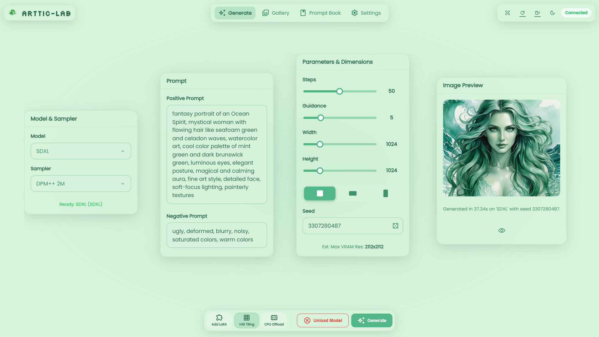
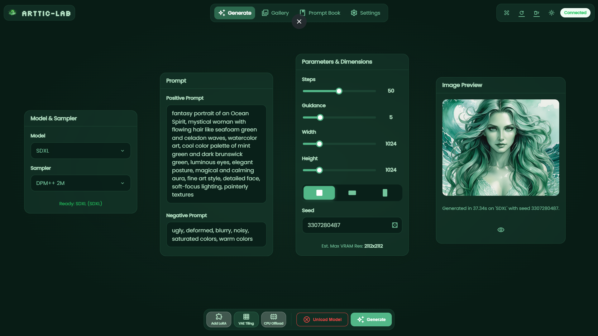
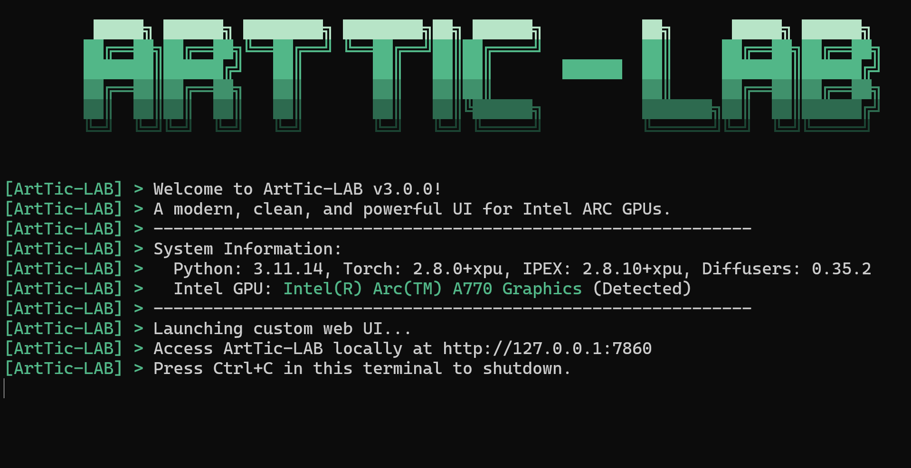
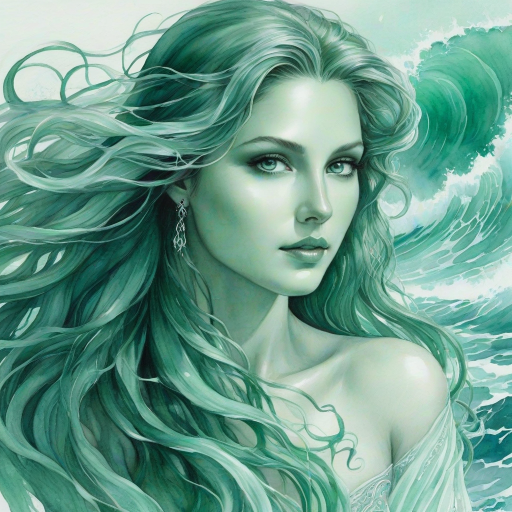
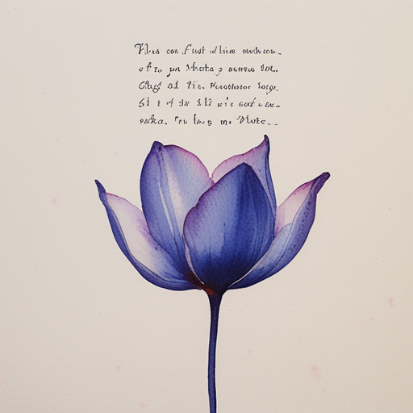
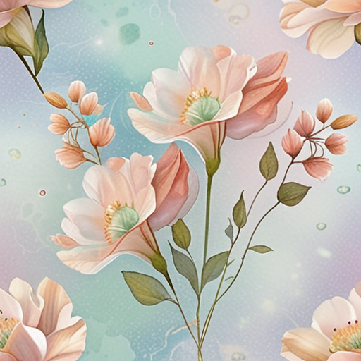
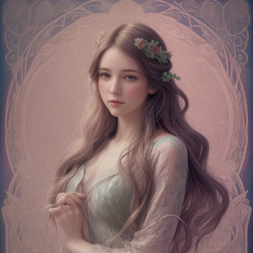
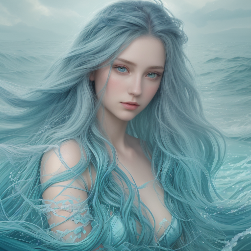
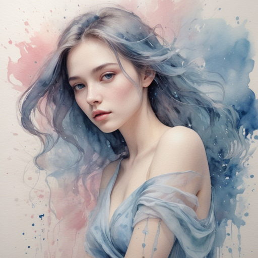

<p align="center">
  
</p>
<p align="center"><em>Built by creators, for creators.</em></p>

<h2 align="center">Your Portal to AI Artistry, Forged for Intel ARC GPUs 🎨</h2>

<p align="center">
  <a href="https://opensource.org/licenses/MIT">
    
  </a>
  <a href="https://www.intel.com/content/www/us/en/products/docs/arc-discrete-graphics.html">
    
  </a>
  <a href="https://github.com/Md-Siam-Mia-Man/ArtTic-LAB/stargazers">
    
  </a>
  <a href="https://github.com/Md-Siam-Mia-Man/ArtTic-LAB/issues">
    
  </a>
  <a href="https://github.com/Md-Siam-Mia-Man/ArtTic-LAB/commits/main">
    
  </a>
</p>

---

ArtTic-LAB is a **modern, performance-driven** AI image generation suite — precision-engineered for the Intel® Arc™ GPU ecosystem.  
It delivers a fluid **graphical interface** for creators and a **robust CLI** for power users who automate.

This isn’t just a wrapper — it’s a ground-up application designed for **speed, aesthetics, and a frictionless creative workflow**.  
With full support for models from **Stable Diffusion 1.5 → SDXL → SD3 → FLUX**, ArtTic-LAB is the definitive creative tool for ARC GPU users. ✨

---

## 🧭 Two Ways to Create

ArtTic-LAB adapts to your preferred workflow — visual or terminal-based.

| GUI (Light)                               | GUI (Dark)                              | CLI                               |
| ----------------------------------------- | --------------------------------------- | --------------------------------- |
|  |  |  |
| Light mode interface                      | Dark mode interface                     | Terminal interface                |

---

## ⚙️ Feature Deep Dive

| Category                       | Highlights                                                                                                                                                               |
| ------------------------------ | ------------------------------------------------------------------------------------------------------------------------------------------------------------------------ |
| **Engineered for Speed 🏎️**    | - **IPEX Optimization:** Intel® Extension for PyTorch optimizes UNet & VAE.<br>- **Mixed Precision:** Runs in `bfloat16` for ~2× faster performance & ~50% VRAM savings. |
| **Intelligent Pipeline 🧠**    | - Auto-detects architecture (SD1.5 → SD3 → FLUX).<br>- Predicts VRAM-safe maximum resolution to prevent OOM errors.                                                      |
| **Total VRAM Control 💧**      | - One-click model unload & VAE tiling for high-res stability.<br>- Adaptive CPU/GPU offloading for efficient memory use.                                                 |
| **Streamlined for Artists ✨** | - Responsive async UI — no freezes.<br>- Unified node-based interface for full creative control.<br>- Smooth gallery with zoom & drag support.                           |

---

## 📸 Creations Gallery

> Each image is displayed inside a consistent **512×512** viewport. Images preserve their original aspect ratio and are centered and scaled to fit. This keeps the gallery tidy while avoiding distortion.

<table>
  <tr>
    <td align="center">
      <div style="width:78px;height:78px;display:flex;align-items:center;justify-content:center;overflow:hidden;border-radius:8px;border:1px solid #e6e6e6;">
        
      </div>
      <p>Demo 1</p>
    </td>
    <td align="center">
      <div style="width:78px;height:78px;display:flex;align-items:center;justify-content:center;overflow:hidden;border-radius:8px;border:1px solid #e6e6e6;">
        
      </div>
      <p>Demo 2</p>
    </td>
    <td align="center">
      <div style="width:78px;height:78px;display:flex;align-items:center;justify-content:center;overflow:hidden;border-radius:8px;border:1px solid #e6e6e6;">
        
      </div>
      <p>Demo 3</p>
    </td>
  </tr>

  <tr>
    <td align="center">
      <div style="width:78px;height:78px;display:flex;align-items:center;justify-content:center;overflow:hidden;border-radius:8px;border:1px solid #e6e6e6;">
        
      </div>
      <p>Demo 4</p>
    </td>
    <td align="center">
      <div style="width:78px;height:78px;display:flex;align-items:center;justify-content:center;overflow:hidden;border-radius:8px;border:1px solid #e6e6e6;">
        
      </div>
      <p>Demo 5</p>
    </td>
    <td align="center">
      <div style="width:78px;height:78px;display:flex;align-items:center;justify-content:center;overflow:hidden;border-radius:8px;border:1px solid #e6e6e6;">
        
      </div>
      <p>Demo 6</p>
    </td>
  </tr>

  <tr>
    <td align="center">
      <div style="width:78px;height:78px;display:flex;align-items:center;justify-content:center;overflow:hidden;border-radius:8px;border:1px solid #e6e6e6;">
        
      </div>
      <p>Demo 7</p>
    </td>
    <td align="center">
      <div style="width:78px;height:78px;display:flex;align-items:center;justify-content:center;overflow:hidden;border-radius:8px;border:1px solid #e6e6e6;">
        
      </div>
      <p>Demo 9</p>
    </td>
    <td align="center">
      <div style="width:78px;height:78px;display:flex;align-items:center;justify-content:center;overflow:hidden;border-radius:8px;border:1px solid #e6e6e6;">
        
      </div>
      <p>Demo 10</p>
    </td>
  </tr>
</table>

> Notes:
>
> - Each image uses `max-width:100%` and `max-height:100%` inside a fixed `512×512` container to preserve aspect ratio and avoid cropping.
> - If a demo image is smaller than 512px in either dimension it will be centered at true size; if larger, it will scale down to fit inside the box.

---

## 🚀 Get Started in Minutes

Launch your personal AI art studio in three simple steps.

### 1️⃣ Prerequisites

- Install **Miniconda** or **Miniforge**.
- Reopen your terminal to ensure `conda` is available.

### 2️⃣ Installation

Download and unzip this project, then run the one-time installer:

- **Windows 🪟:** `install.bat`
- **Linux/macOS 🐧:** `chmod +x install.sh && ./install.sh`

### 3️⃣ Launch & Create

Start ArtTic-LAB:

- **Windows:** `start.bat`
- **Linux/macOS:** `./start.sh`

Open your browser at `http://127.0.0.1:7860`.

<details>
<summary><strong>👉 Optional Launch Arguments</strong></summary>

- `--disable-filters` → Enable full logs for debugging.
</details>

---

## 📂 Project Structure

```bash
ArtTic-LAB/
├── 📁assets/        # Banners, demos, UI screenshots
├── 📁core/          # Core application logic
├── 📁helpers/       # CLI manager & utilities
├── 📁models/        # Drop your .safetensors models here
├── 📁outputs/       # Generated masterpieces
├── 📁pipelines/     # Core logic for SD model variants
├── 📁web/           # Custom FastAPI web UI
├── 📜app.py         # Main application launcher
├── 📜install.bat    # Windows one-click installer
├── 📜start.bat      # Windows launcher
└── 📜...            # Additional project files
```
